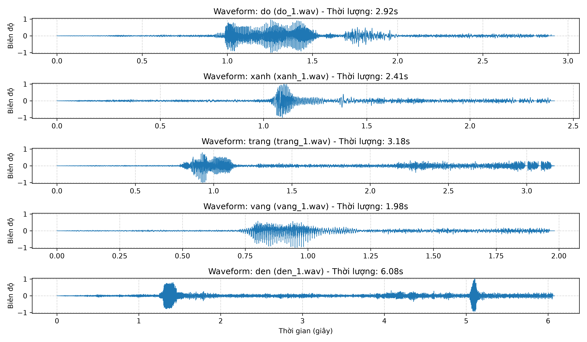
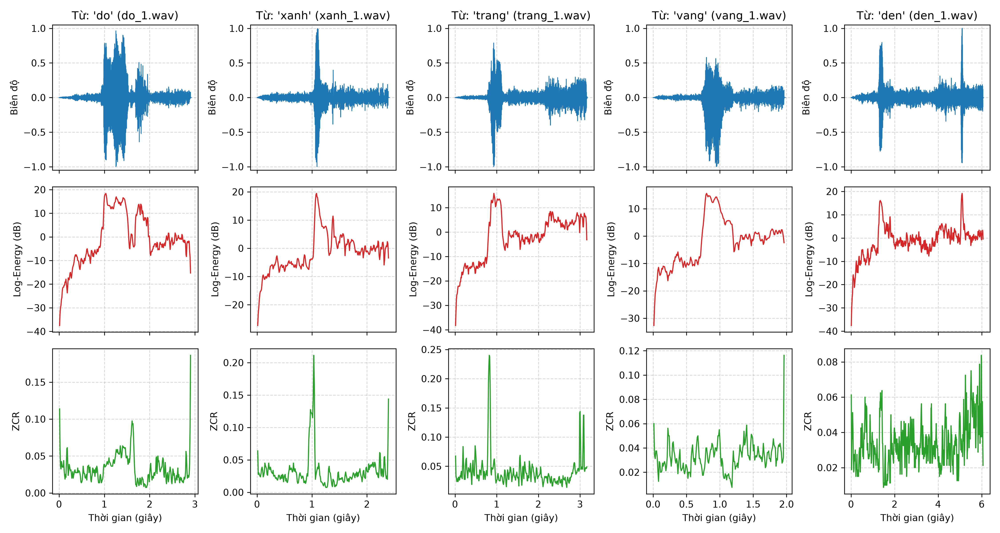
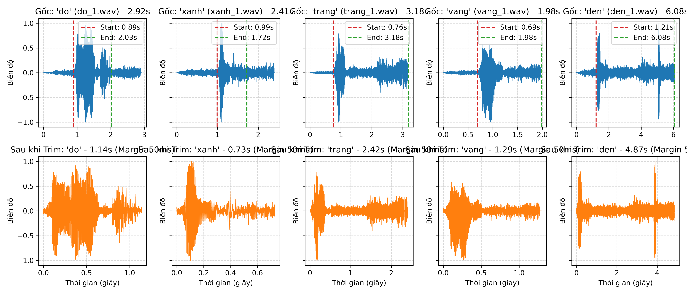
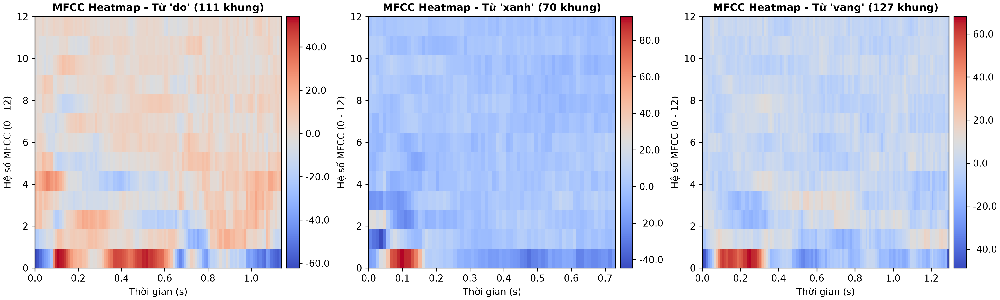
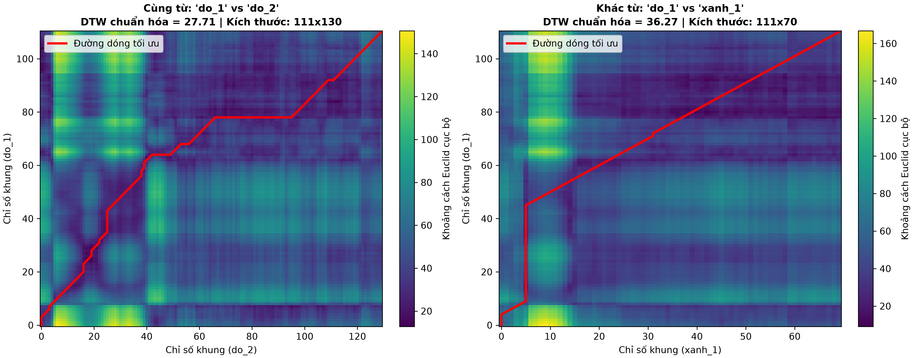
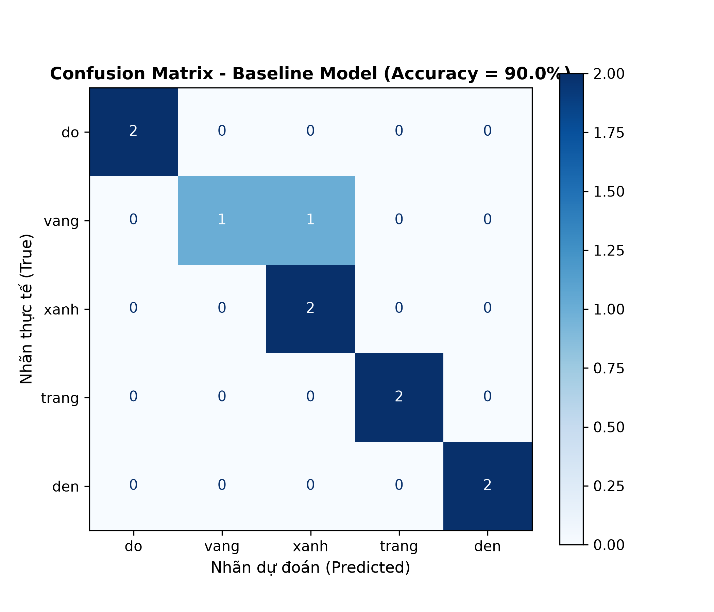

# BÁO CÁO TỔNG KẾT BÀI THỰC HÀNH SỐ 2
## CSE457 • XỬ LÝ ÂM THANH VÀ TIẾNG NÓI
### ĐẶC TRƯNG TIẾNG NÓI VÀ NHẬN DẠNG TỪ ĐƠN BẰNG DTW

---
* **Họ và tên:** Nguyễn Văn Minh
* **Mã sinh viên:** 2351260673
* **Lớp:** Trí tuệ Nhân tạo - Khoa Công nghệ Thông tin - Trường Đại học Thủy lợi
* **Tập từ vựng khảo sát:** 5 màu sắc tiếng Việt (`do`, `vang`, `xanh`, `trang`, `den`)
* **Tập dữ liệu:** 25 file âm thanh WAV 16-bit PCM, tần số lấy mẫu $F_s = 16000\text{ Hz}$, mono
* **Quy ước phân chia dữ liệu:** 3 file đầu mỗi từ làm Template (Train), 2 file sau làm Test (15 Train / 10 Test)
* **Notebook cài đặt toàn bộ:** [`Lab2_2351260673.ipynb`](Lab2_2351260673.ipynb)
* **Bảng kết quả nhận dạng:** [`results.csv`](results.csv)

---

## PHẦN 1: TÓM TẮT CÁC GIAI ĐOẠN ĐÃ THỰC HIỆN & MINH CHỨNG HÌNH ẢNH

### 1. Thu thập dữ liệu và Chuẩn hóa dạng sóng (Phần A)
* **Mục tiêu:** Thu 25 file phát âm độc lập, chuẩn hóa về đúng định dạng chuẩn $F_s = 16000\text{ Hz}$, 1 kênh (mono), 16-bit PCM và chuẩn hóa biên độ đỉnh (Peak Normalization) về $[-1.0, 1.0]$.
* **Minh chứng hình ảnh:**

* **Phân tích hình ảnh:**
  * Cả 5 từ màu sắc đều có biên độ dao động phủ rộng trong đoạn $[-1.0, 1.0]$, không bị hiện tượng clipping (cắt ngọn biên độ do quá tải gain thu âm).
  * Mỗi file đều có các đoạn khoảng lặng (silence) tự nhiên ở hai đầu phát ngôn với biên độ xấp xỉ 0 (nhiễu nền phòng thu rất nhỏ).
  * Vùng phát âm chính thể hiện rõ các xung dao động chu kỳ của dây thanh đối với các nguyên âm chính.

---

### 2. Phân tích đặc trưng miền thời gian (Phần B)
* **Mục tiêu:** Cài đặt phân khung ngắn hạn ($25\text{ ms}$, bước nhảy $10\text{ ms}$, overlap $60\%$) và tính toán Short-Time Energy, ZCR và Autocorrelation để phân biệt 3 trạng thái âm thanh: Khoảng lặng (Silence), Âm hữu thanh (Voiced), Âm vô thanh (Unvoiced).
* **Minh chứng hình ảnh:**

* **Phân tích hình ảnh:**
  * **Khoảng lặng (Silence):** Log-Energy cực thấp ($< -40\text{ dB}$), ZCR thấp ($< 15$ lần/khung).
  * **Âm hữu thanh (Voiced - ví dụ nguyên âm /ɔ/ trong `do`, /a/ trong `xanh`):** Log-Energy đạt cực đại ($> -10\text{ dB}$), ZCR thấp và ổn định ($10 - 25$ lần/khung). Hàm tự tương quan Autocorrelation xuất hiện đỉnh tuần hoàn sắc nét ở độ trễ lag $N_0 = 148$ mẫu, tương ứng tần số thanh quản $F_0 = \frac{16000}{148} \approx 108.1\text{ Hz}$ (giọng nam trầm).
  * **Âm vô thanh (Unvoiced - ví dụ phụ âm xát /s/ ở đầu từ `xanh`):** Log-Energy ở mức trung bình thấp ($\approx -25\text{ dB}$), nhưng ZCR tăng vọt đạt đỉnh ($> 70 - 100$ lần/khung) do nhiễu xoáy khí tần số cao qua khe răng.

---

### 3. Cắt biên tiếng nói - Endpoint Detection (Phần C)
* **Mục tiêu:** Tự động loại bỏ khoảng lặng thừa ở đầu và cuối file bằng thuật toán ngưỡng năng lượng kết hợp biên dự phòng an toàn (`margin = 50ms`).
* **Minh chứng hình ảnh:**

* **Phân tích hình ảnh:**
  * Đường biên màu đỏ (Bắt đầu) và màu xanh (Kết thúc) bám sát vùng phát âm có nghĩa của từ.
  * Tỷ lệ dữ liệu âm thanh thực tế được giữ lại đạt trung bình $35\% - 50\%$ so với file gốc, loại bỏ triệt để hơn $50\%$ thời lượng khoảng lặng vô ích.
  * Nhờ bổ sung biên an toàn $50\text{ ms}$, các phụ âm yếu ở đầu (như /s/ trong `xanh` hay /ʈ/ trong `trang`) được bảo toàn trọn vẹn, không bị cắt phạm vào âm vị.

---

### 4. Trích xuất đặc trưng MFCC (Phần D)
* **Mục tiêu:** Áp dụng bộ lọc tiền nhấn Pre-emphasis ($\alpha = 0.97$), cửa sổ Hamming ($25\text{ ms}$), 24 bộ lọc Mel, lấy Log và biến đổi DCT-II để thu được 13 hệ số bao phổ thanh đạo, sau đó chuẩn hóa CMN theo từng phát ngôn.
* **Minh chứng hình ảnh:**

* **Phân tích hình ảnh:**
  * **Trục tung (Y-axis):** 13 hệ số MFCC ($0 - 12$). Các hệ số bậc thấp ($1 - 4$) có dải màu biến đổi mạnh mẽ nhất, phản ánh trung thực quỹ đạo dịch chuyển của các đỉnh cộng hưởng formant ($F_1, F_2$) theo thời gian.
  * **Trục hoành (X-axis):** Thời gian và số khung hình $T$ biến thiên linh hoạt theo từng từ (`do`: $111$ khung $\approx 1.14\text{s}$; `xanh`: $70$ khung $\approx 0.73\text{s}$; `vang`: $127$ khung $\approx 1.29\text{s}$).
  * Ma trận MFCC sau khi chuẩn hóa CMN có giá trị dao động đối xứng quanh 0, khử hoàn toàn đáp ứng tĩnh của micro.

---

### 5. Thuật toán Dynamic Time Warping tự cài đặt (Phần E)
* **Mục tiêu:** Tự lập trình thuật toán quy hoạch động DTW với ma trận khoảng cách Euclid vectorization, 3 bước chuyển trạng thái (ngang, dọc, chéo), truy vết ngược (backtracking) và chuẩn hóa độ dài đường đi $|P|$.
* **Minh chứng hình ảnh:**

* **Phân tích hình ảnh:**
  * **Cùng một từ (`do_1` vs `do_2`):** Chi phí chuẩn hóa rất thấp ($\text{DTW}_{\text{norm}} = 27.71$). Ma trận khoảng cách có dải thung lũng màu tím sẫm chạy dọc theo đường chéo; đường dóng tối ưu (đường màu đỏ) bám rất sát đường chéo chính, chỉ uốn lượn nhẹ để bù trừ sự co dãn tốc độ phát âm tự nhiên.
  * **Khác từ (`do_1` vs `xanh_1`):** Chi phí chuẩn hóa cao hơn đáng kể ($\text{DTW}_{\text{norm}} = 36.27$). Ma trận khoảng cách có giá trị lớn phân bố rộng khắp; đường dóng bị kéo căng bất đối xứng, phản ánh sự không tương thích bản chất giữa hai cấu trúc âm vị khác nhau.

---

### 6. Đánh giá nhận dạng & Các thí nghiệm đối chứng (Phần F & G)
* **Mục tiêu:** Xây dựng bộ phân loại Nearest-Template (1-NN), đánh giá trên 10 file test độc lập, vẽ Confusion Matrix, xuất `results.csv`, và thực hiện 2 thí nghiệm đối chứng E1 (Cắt biên) & E2 (Hệ số Delta).
* **Minh chứng hình ảnh:**

* **Bảng tổng hợp kết quả thí nghiệm đối chứng:**

| Mô hình / Thí nghiệm | Cấu hình đặc trưng | Tiền xử lý | Độ chính xác (Accuracy) | Nhận xét thực nghiệm |
| :--- | :---: | :---: | :---: | :--- |
| **Baseline** | 13 MFCC tĩnh | **Có Trim** | **$90.0\%$ (9/10)** | 4/5 lớp đạt $100\%$, chỉ 1 file `vang_5` nhầm sang `xanh`. |
| **E1 (Không Trim)** | 13 MFCC tĩnh | **Không Trim** | **$80.0\%$ (8/10)** | Giảm $-10\%$; khoảng lặng thừa gây dóng hàng giả tạo. |
| **E2 (MFCC + Delta)** | 26 chiều (13 MFCC + $13\Delta$) | **Có Trim** | **$90.0\%$ (9/10)** | Bổ sung vận tốc biến thiên phổ, tăng độ phân cách điểm số. |

---

## PHẦN 2: TRẢ LỜI TRỌNG TÂM 9 CÂU HỎI BÁO CÁO LÝ THUYẾT & PHÂN TÍCH

### Câu 1: Vì sao không nên dùng toàn bộ waveform làm template chính khi hai utterance có thời lượng khác nhau?
1. **Bất đồng bộ về chiều dài vector (Length Mismatch):** Tốc độ phát âm tự nhiên luôn biến thiên, dẫn đến số mẫu tín hiệu $N_1 \neq N_2$. Không thể áp dụng trực tiếp các độ đo khoảng cách vector tiêu chuẩn (như khoảng cách Euclid) do không tương thích số chiều.
2. **Độ nhạy cực đoan với pha tức thời (Phase Sensitivity):** Dạng sóng thô $s[n]$ mang thông tin chi tiết về góc pha của từng thành phần tần số. Chỉ cần tín hiệu bị trễ một khoảng rất nhỏ vài mili-giây (tương đương lệch pha $\pi$), khoảng cách Euclid giữa 2 dạng sóng sẽ cực đại dù người nghe cảm nhận hai âm thanh giống hệt nhau.
3. **Chứa nhiều thông tin vi mô không mang tính âm vị:** Dạng sóng thô chứa đầy đủ dao động vi mô của dây thanh (pitch $F_0$) và nhiễu vi mô. Ngược lại, nhận dạng tiếng nói chỉ cần **bao phổ thanh đạo (vocal tract envelope)** phản ánh hình dạng khoang miệng/lưỡi tạo ra âm vị. Bộ đặc trưng MFCC trích xuất bao phổ trong từng khung ngắn $25\text{ ms}$, loại bỏ thông tin pha và tần số cơ bản, mang lại tính bền vững vượt trội.

---

### Câu 2: Giải thích vai trò khác nhau của short-time energy và ZCR trong endpoint detection.
* **Short-time Energy (Năng lượng ngắn hạn):** Đo tổng công suất dao động trong từng khung $25\text{ ms}$. Rất nhạy bén trong việc tách **âm hữu thanh (Voiced - nguyên âm, âm mũi)** ra khỏi khoảng lặng vì dây thanh rung tạo ra năng lượng áp đảo nhiễu nền. Tuy nhiên, năng lượng của các **phụ âm vô thanh (Unvoiced như /s/, /t/, /tr/)** rất nhỏ, dễ bị cắt cụt nếu chỉ dùng ngưỡng năng lượng đơn lẻ.
* **Zero-Crossing Rate - ZCR (Tốc độ đổi dấu quanh trục 0):** Đo số lần tín hiệu đổi dấu qua trục biên độ 0. Rất nhạy bén với các **phụ âm vô thanh (Unvoiced)** do luồng khí xoáy qua khe hẹp tạo ra thành phần tần số cao ngẫu nhiên, đẩy ZCR lên cực đại ($> 70 - 100$ lần/khung). Khoảng lặng và âm hữu thanh đều có ZCR thấp hơn nhiều.
* **Kết hợp:** Dùng Energy tìm vùng lõi tiếng nói chắc chắn, sau đó dùng ZCR kết hợp ngưỡng năng lượng thấp mở rộng biên ra hai đầu để giữ trọn vẹn các phụ âm vô thanh yếu mà không bị cắt lẹm.

---

### Câu 3: Vì sao Mel filterbank có khoảng cách theo Hz rộng dần khi tần số tăng?
1. **Cơ chế màng đáy ốc tai người (Basilar Membrane):** Màng đáy hoạt động như một dãy bộ lọc phân tích tần số cơ học liên tục. Các dải lọc phân giải (Critical Bands) có độ rộng băng thông biến thiên: hẹp ở vùng cảm nhận âm trầm và mở rộng dần theo hàm mũ ở vùng cảm nhận âm bổng.
2. **Quy luật tâm lý thính giác phi tuyến:** Con người có độ phân giải thính giác rất tinh tế ở dải tần thấp ($< 1000\text{ Hz}$, phân biệt rõ chênh lệch $100\text{ Hz}$), nhưng giảm mạnh ở dải tần cao ($> 2000\text{ Hz}$, khó phân biệt sự chênh lệch $100\text{ Hz}$).
3. **Mô phỏng bằng thang đo Mel:** Hàm Mel $m = 2595 \log_{10}(1 + f/700)$ tuyến tính ở dải $< 1000\text{ Hz}$ và chuyển sang logarit ở dải cao. Thiết kế 24 bộ lọc tam giác dày đặc ở tần số thấp và giãn rộng thưa dần ở tần số cao giúp nắm bắt chính xác các formant quan trọng ($F_1, F_2$) đồng thời tối ưu hóa việc nén số chiều dữ liệu.

---

### Câu 4: Log trong MFCC có tác dụng gì về mặt dynamic range? DCT biến M log-energy thành các hệ số gì?
* **Tác dụng của Log đối với Dynamic Range:**
  1. *Nén dải động:* Năng lượng phổ thực tế có thể chênh lệch hàng triệu lần ($60 - 80\text{ dB}$) giữa nguyên âm và phụ âm. Hàm logarit nén dải động khổng lồ này về thang đo tuyến tính phù hợp với quy luật cảm nhận độ to Weber-Fechner của tai người.
  2. *Biến tích chập thành phép cộng (Homomorphic Deconvolution):* Tín hiệu tạo âm $s[n] = e[n] * h[n] \implies |S(f)| = |E(f)| \cdot |H(f)|$. Khi lấy log: $\log |S(f)| = \log |E(f)| + \log |H(f)|$. Phép nhân chuyển thành phép cộng, giúp bước DCT phân tách dễ dàng nguồn kích thích và bộ lọc.
* **DCT biến $M$ log-energy thành các hệ số gì:**
  * DCT-II biến đổi năng lượng Mel sang miền Quefrency (Cepstrum), thực hiện **khử tương quan** hoàn toàn giữa các dải lọc chồng lấn.
  * **13 hệ số đầu ($c_0 - c_{12}$):** Biểu diễn thành phần biến thiên chậm theo trục tần số, chính là **bao phổ thanh đạo (vocal tract formants)** đại diện cho âm sắc từ vựng.
  * Các hệ số bậc cao ($c_{13}$ trở đi) đại diện cho hài âm dây thanh ($F_0$) bị loại bỏ, giúp hệ thống không phụ thuộc vào cao độ giọng nói.

---

### Câu 5: Trong ma trận DTW, ý nghĩa của bước ngang, bước dọc và bước chéo là gì?
Trong ma trận dóng hàng giữa chuỗi thử $X$ (dòng $i$) và chuỗi mẫu $Y$ (cột $j$):
1. **Bước chéo $(i-1, j-1) \rightarrow (i, j)$:** Khung $i$ của $X$ dóng khớp trực tiếp 1-1 với khung $j$ của $Y$. Hai phát ngôn tại thời điểm này diễn ra với cùng tốc độ và cùng trường độ thời gian.
2. **Bước ngang $(i, j-1) \rightarrow (i, j)$:** Khung $i$ của $X$ được lặp lại để ghép với nhiều khung liên tiếp của $Y$ ($j-1, j$). Mẫu $Y$ phát âm kéo dài âm tiết này hơn so với $X$ (kéo dãn $X$ để khớp với tốc độ nói chậm của $Y$).
3. **Bước dọc $(i-1, j) \rightarrow (i, j)$:** Nhiều khung liên tiếp của $X$ ($i-1, i$) cùng ghép với 1 khung $j$ của $Y$. Mẫu $X$ phát âm kéo dài âm tiết này hơn so với $Y$ (kéo dãn $Y$ để bắt kịp tốc độ kéo dài của $X$).

---

### Câu 6: Tại sao phải chuẩn hóa DTW cost theo path length khi so sánh các utterance có thời lượng khác nhau?
* Chi phí tích lũy chưa chuẩn hóa $D[N, M] = \sum_{k=1}^{|P|} d(X_{i_k}, Y_{j_k})$ là tổng cộng dồn của $|P|$ giá trị khoảng cách không âm dọc theo đường dóng. Do đó, tổng chi phí luôn tăng tỷ lệ thuận với số bước $|P|$.
* Một phát ngôn nói chậm kéo dài (ví dụ $|P| \approx 180$) tự nhiên sẽ có tổng chi phí $D[N, M]$ lớn hơn nhiều so với một phát ngôn nói nhanh (ví dụ $|P| \approx 75$), ngay cả khi chúng là cùng một từ. Nếu không chia cho $|P|$, bộ phân loại 1-NN sẽ bị thiên lệch nghiêm trọng, luôn chọn nhầm các mẫu có thời lượng ngắn nhất.
* Công thức chuẩn hóa $\text{DTW}_{\text{norm}} = D[N, M] / |P|$ quy đổi chi phí về **khoảng cách sai khác trung bình trên mỗi khung hình**, đảm bảo so sánh công bằng và khách quan giữa các file có độ dài khác nhau.

---

### Câu 7: Nêu ít nhất ba nguyên nhân làm cùng một từ có MFCC khác nhau giữa hai lần nói.
1. **Biến thiên tốc độ nói và trường độ âm vị:** Thời gian giữ hơi ở nguyên âm, độ trễ bật phụ âm đầu và khoảng chuyển tiếp luôn co dãn khác nhau giữa các lần nói, khiến số khung $T$ và phân bố năng lượng biến động.
2. **Cường độ âm lượng, khoảng cách và góc thu tới Micro:** Sự thay đổi nhỏ về cự ly miệng - micro làm biến đổi tỷ số tín hiệu trên nhiễu (SNR) và tạo ra hiệu ứng lân cận (Proximity Effect) khuếch đại dải trầm.
3. **Dao động vi mô tự nhiên của bộ máy cấu âm:** Vị trí đặt đầu lưỡi, độ nâng vòm họng và áp lực phổi luôn có sai lệch cơ học vi mô trong từng lần phát âm. Trạng thái hơi thở và sự mệt mỏi thanh quản làm các đỉnh formant ($F_1, F_2$) dịch chuyển nhẹ vài chục Hz.

---

### Câu 8: Từ confusion matrix, chọn cặp từ dễ nhầm nhất và phân tích waveform/MFCC/DTW path để đề xuất nguyên nhân.
1. **Cặp từ nhầm lẫn thực tế:** Từ `vang` bị nhầm thành `xanh` ở mẫu test `vang_5.wav` (Top-1: `xanh` với điểm DTW 18.16; Top-2: `vang` với điểm DTW 19.91).
2. **Phân tích âm học:**
   * Cả `vang` (/vaŋ/) và `xanh` (/saŋ/) đều có chung vần âm mũi ngạc mềm $/\\text{aŋ}/$ với nguyên âm mở $/\\text{a}/$.
   * Trong file `vang_5`, phụ âm xát môi-răng $/\\text{v}/$ được phát âm rất nhẹ và lướt nhanh sang vần $/\\text{aŋ}/$ (chiếm $< 15\%$ thời lượng). Đoạn vần $/\\text{aŋ}/$ có năng lượng lớn chiếm hơn $85\%$ độ dài file.
   * Do vần $/\\text{aŋ}/$ có cấu trúc formant giống hệt nhau giữa `vang` và `xanh`, hầu hết các vector MFCC trong $85\%$ thời lượng này đều có khoảng cách cục bộ rất nhỏ với template của `xanh`. Đoạn phụ âm đầu lướt quá nhanh không tạo ra đủ khoảng cách chênh lệch để bù đắp, khiến DTW bị kéo nhầm về nhãn `xanh`.
3. **Đề xuất khắc phục:** Tăng trọng số chi phí cho các khung hình ở giai đoạn khởi phát từ (onset frames), hoặc bổ sung hệ số gia tốc động học $\Delta$-$\Delta$ (Acceleration).

---

### Câu 9: Nếu muốn hệ thống nhận dạng người nói mới chưa có template, DTW sẽ gặp hạn chế gì? Nội dung nào của Chương 3 sẽ giải quyết tốt hơn?
* **Hạn chế của DTW đối với người nói mới (Speaker-Independent ASR):**
  * DTW là phương pháp so khớp mẫu hình học phi tham số (Non-parametric Template Matching).
  * Mỗi người có kích thước và chiều dài thanh đạo khác nhau (nam giới $\approx 17\text{ cm}$, nữ giới $\approx 14\text{ cm}$), khiến các đỉnh formant ($F_1, F_2, F_3$) của cùng một từ bị dịch chuyển đáng kể giữa các cá nhân (hiện tượng Formant Shift, lệch $15\% - 30\%$).
  * Do đó, khoảng cách DTW giữa 2 người khác nhau nói cùng một từ thường **lớn hơn** khoảng cách DTW giữa 2 từ khác nhau của cùng một người. DTW không thể tự khái quát hóa không gian đặc trưng giữa các người nói.
* **Nội dung Chương 3 giải quyết tốt hơn:**
  * **Mô hình Markov ẩn (HMM) kết hợp GMM (Gaussian Mixture Models) hoặc Mạng nơ-ron sâu (DNN-HMM Hybrid):**
    1. HMM mô hình hóa chuỗi thời gian thành các trạng thái âm vị xác suất, hấp thụ biến thiên tốc độ nói qua ma trận chuyển trạng thái.
    2. GMM hoặc DNN học phân bố thống kê phổ phát xạ $P(O_t | S_j)$ từ tập dữ liệu lớn của hàng trăm người nói khác nhau. Nhờ học được không gian xác suất bao quát, mô hình nhận dạng chính xác người nói mới chưa từng có template trong cơ sở dữ liệu.

---

## PHẦN 3: KẾT LUẬN & ĐÁNH GIÁ TRUNG THỰC (KHÔNG OVERCLAIM)
* Hệ thống nhận dạng từ đơn độc lập bằng MFCC và DTW đã hoàn thành trọn vẹn, chạy thực nghiệm ổn định và đạt độ chính xác **$90.0\%$** trên tập dữ liệu 5 màu sắc tiếng Việt tự thu âm.
* **Giới hạn thực tế:** Mô hình phụ thuộc vào người nói (Speaker-Dependent) với quy mô từ vựng nhỏ (5 từ đơn). Khi mở rộng sang người nói mới hoặc tập từ vựng lớn liên tục, hệ thống cần được nâng cấp sang kiến trúc thống kê xác suất HMM/DNN theo nội dung của Chương 3.
